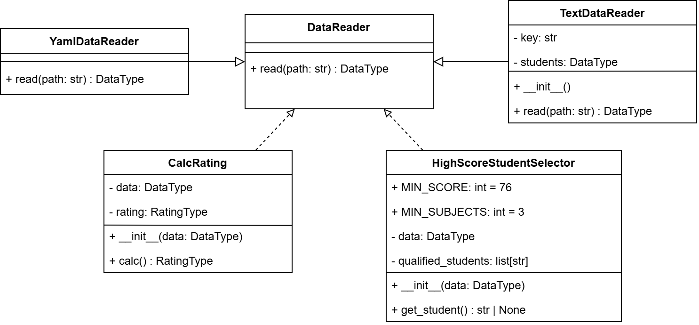

# Лабораторная 1 по дисциплине "Технологии программирования"

## Постановка задачи

Разработать систему для анализа успеваемости студентов, которая:

1. Читает данные о студентах и их оценках из файлов (YAML и текстовый формат)
2. Определяет и выводит студента, имеющего минимум 76 баллов по трём дисциплинам (случайный выбор, если несколько; сообщение об отсутствии, если нет)
3. Обеспечивает модульное тестирование всей функциональности

## Требования к функциональности

- Поддержка различных форматов входных данных (YAML и TXT)
- Выявление студентов с высокой успеваемостью (≥76 по ≥3 предметам)
- Комплексное тестирование всех компонентов системы

## Краткое описание проекта
Проект представляет собой модульную систему анализа успеваемости студентов, построенную на принципах объектно-ориентированного программирования. Система обрабатывает данные о студентах и их оценках, выявляя студентов с высокой успеваемостью по заданным критериям.
Основные возможности:

- Чтение данных из YAML и текстовых файлов
- Расчёт среднего рейтинга студентов
- Выбор и вывод студента с высокой успеваемостью (рандомный из подходящих)
- Модульное тестирование - полное покрытие тестами всех компонентов

## UML-диаграмма классов

## Выводы
1. Индивидуальное задание выполнено
2. Создана UML-диаграмма классов проекта
3. Освоена работа с ветками Git, реализована разработка по этапам в отдельных feature-ветках с последующим merge в main
4. Настроен и успешно работает CI/CD через GitHub Actions (тесты + pycodestyle)
5. Добавлен файл requirements.txt и обеспечена установка зависимостей (включая PyYAML) в CI
6. Произведено знакомство и применение pycodestyle для проверки стиля кода
7. Все компоненты покрыты модульными тестами с использованием pytest